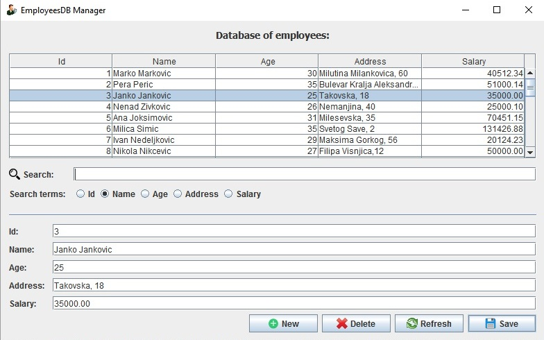

# EmployeesDBManagerHibernate
EmployeesDB Manager is business application that enables easy CRUD manipulation over database of employees and search by three terms: Id, Name, Age, Address and Salary.
The code is written in Java (using Hibernate persistance framework).
COMMENT: To test this application, you you'll have to create a database (MySQL)!

All suggestions are welcome!
